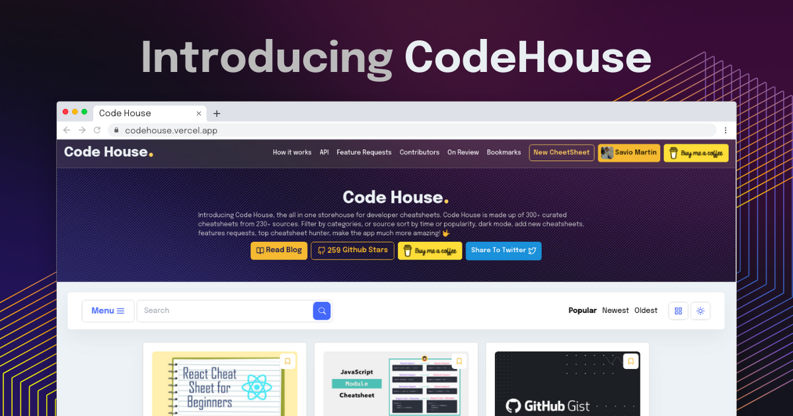

<p align="center">
    
</p>
<p align="center">
    
</p>
<h4 align="center">Store House of 300+ Developer cheatsheets✨️</h4>

<p align="center"></p>

### Introducing Code House ✌️

Code House is the all in one storehouse for developer cheatsheets. Code House is made up of 300+ curated cheatsheets from 230+ sources. Filter by categories, or source, sort by time or popularity, dark mode, bookmark cheatsheets, add new cheatsheets, request feature, and much more features, make the app amazing! 🤟

## 🚀 Demo



## 🧐 Features

Code House comes up with a whole bunch of amazing features to provide you the best experience, Here're some of our best features.

> I recommend you to bookmark code house, because it will become super handy one day!

- 💯 **300+ Cheatsheets**
- 🎩 **Filter by Category** (29 Cateogries)
- 👾 **Filter By Source** (230+ Sources)
- 🔖 **Bookmark Cheatsheets**
- 📦 **Add new Cheatsheet** (on browser itself)
- 🍭 **Seperate page for each Cheatsheet**
- 🌱 **Request for Features**
- 🥁 **API Support** [>> API Usage](API-usage.md)
- 🧐 **Report Cheatsheet**
- 🕊️ **GraphQL Playground**
- 👨‍💻 **Contributors Page**[ >>Contributing](#-contributing)
- 🕒 **Sort by time or popularity**
- 🔎 **Search Filter**
- 🗃️ **Toggle View** (List View or Grid View)
- 🌘 **Dark mode**
- 🔺 **Upvote/Comment on Cheatsheets**
- 📬 **Newsletter** (once a week)
- 💻 **Fully Responsive**
- 🔤 **Reply to a comment**
- 📩 **Create Collections with Bookmarks**
- 📱  **Drag and Drop to arrange collections** 

Code House is the next revolutionary app to hunt the best cheat sheets for all types ✨️

## 🛠️ Installation Steps

1. Clone the repository

```bash
git clone https://github.com/happybrother2022/codehouse.git
```

2. Change the working directory

```bash
cd codehouse
```

3. Install dependencies

```bash
npm install
```

4. Create `.env` file in root and add your variables

```bash
NEXT_PUBLIC_DB_URL= YOUR_HARPER_DB_DATABASE_URL
NEXT_PUBLIC_DB_AUTHORIZATION= YOUR_HARPER_DB_AUTHORIZATION_ID
```

5. Run the app

```bash
npm run dev
```

You are all set! Open [localhost:3000](http://localhost:3000/) to see the app.

## 💻 Built with

- [Next JS](https://nextjs.org/)
- [Harper DB](https://harperdb.io/): source for complete database
- [Tailwind](https://tailwindcss.com/): source for complete styling
- [lodash](https://lodash.com/): for some functions
- [CORS](https://www.npmjs.com/package/cors): for CORS support
- [uuid](https://www.npmjs.com/package/uuid): for generating uuids
- [react-icons](https://react-icons.github.io/react-icons/): for icons
- [react-infinite-scroll-component](https://github.com/ankeetmaini/react-infinite-scroll-component): for infinite scrolling
- [react-ripples](https://github.com/rwu823/react-ripples): for ripple effects
- [nprogress](https://www.npmjs.com/package/nprogress): for slim progressbars
- [parallax-js](http://matthew.wagerfield.com/parallax/): for parallax effects
- [react-hot-toast](https://react-hot-toast.com/): for toasts
- [firebase](https://firebase.google.com/): for authentication
- [date-fns](https://date-fns.org/): for formatting dates
- [Material UI](http://material-ui.com/): for components
- [Animate.css](https://animate.style/): for smooth Animations
- [AOS](https://michalsnik.github.io/aos/): for scroll animations
- [React Beautiful DND](https://react-beautiful-dnd.netlify.app/): For Drag and Drop support on Collections Page
- [Vercel](http://vercel.com/): for hosting

## 🌈 What's next

Code House is the biggest ever project I have made till date, I have a big idea in my mind, and you can see a lot more features coming soon.

Here are some idea that is coming really soon 👀

- Profile Page
- PWA, **In Progress ⏳️**
- Markdown support for feature requests
- Twitter and Facebook Auth, **In Progress ⏳️**
- Perform Operations with API
- Featuring Cheatsheets on day basis
- Generate Cover Image for missing ones
- Settings page
- Choose Secondary color
- Notification tab
- AMP Support, **In Progress ⏳️**
- Hear description for posts, **In Progress ⏳️**

## 💪 Thanks to the all Contributors

Thanks a lot for spending your time in helping code house grow and help many developers. Thanks a lot! Keep rocking 🍻

## 🙏 Support

This project needs a ⭐️ from you. Don't forget to leave a star ⭐️

---

<h3 align="center">
Code House needs a ⭐️ from you
</h3>
